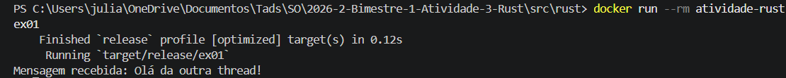
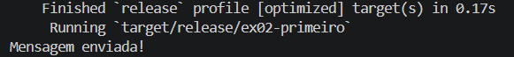
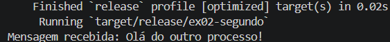
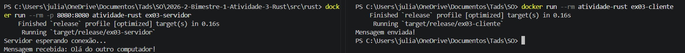

# Relatório sobre implementação de comunicação entre tarefas em Rust

## Introdução

Este relato faz parte do processo avaliativo da disciplina de sistemas operacionas no curso superior em análise e desenvolvimento de sistemas, ofertado na Diretoria acadêmica de gestão e tecnologia da informação no campus natal-central do instituto federal de educação, ciência e tecnologia do rio grande do norte.

Tem como objetivo principal relatar as implementações de comunicação entre tarefas na linguagem Rust.

O grupo de trabalho foi formado por Julia Rafaelly Siqueira de Lima, Lídia Rebeka da Silva Fernandes e Lyonara da Silva Carmêlo.

## Comunicação entre tarefas em Rust

### Informações gerais

#### OBJETIVO DA COMUNICAÇÃO ENTRE TAREFAS:
Permitir que partes de um programa trabalhem juntas
<br>
> * Troca de dados; <br>
> * Coordenação da execução; <br>
> * Não concorrente.
<br>

Em Rust, essa troca acontece de maneira segura, sem as duas threads acessarem a mesma variável ao mesmo tempo de forma direta.

#### SOBRE O DOCKER:
O uso do docker se dá por praticidade, visto que não é necessária a instalação da linguagem Rust em diferentes máquinas. A configuração docker usada foi:
<br>
```dockerfile
FROM rust:1.85
WORKDIR /app
COPY Cargo.toml ./
COPY lib.rs ./lib.rs
COPY bin ./bin
RUN cargo build --release
ENTRYPOINT ["cargo", "run", "--release", "--bin"]
```
<br>

### Comunicação entre tarefas com linhas de execução no mesmo processo

#### CÓDIGO
O código cria duas threads capazes de se comunicar por meio de um __canal (channel)__, uma thread é responsável por __enviar__ a mensagem e a outra por __receber__
<br>

```rust
use std::sync::mpsc;
use std::thread;

fn main() {
    // Cria um canal
    let (tx, rx) = mpsc::channel(); //tx -> transmissor rx -> receptor

    // Cria uma nova thread
    thread::spawn(move || { //manda o valor de tx
        let mensagem = "Olá da outra thread!";

        // Envia a mensagem
        tx.send(mensagem).unwrap(); //envia a mensagem pelo canal
        //unwrap -> encerra o programa com erro caso o envio falhe
    });

    // Recebe a mensagem
    let mensagem_recebida = rx.recv().unwrap();
    //recv -> espera a mensagem chegar

    println!("Mensagem recebida: {}", mensagem_recebida);
}
```
> Disponível em: 2026-2-Bimestre-1-Atividade-3-Rust -> src -> rust -> bin -> "ex01.rs"

#### EXECUÇÃO
O primeiro passo sempre é adicionar o arquivo às configurações do Cargo.toml

__Comandos:__
>docker build -t atividade-rust .

Ele cria/recria a imagem do programa

>docker run --rm atividade-rust ex01

Ele executa o código presente na imagem

__Saída:__
> Mensagem recebida: Olá da outra thread!



##### PROBLEMAS
__1. Docker fechado:__
Durante a execução do código o docker precisa estar aberto

### Comunicação entre tarefas em processos diferentes no mesmo computador

#### CÓDIGO
Dividido em dois programas, onde o primeiro envia uma mensagem para o segundo

__Primeiro programa:__ Enviar mensagem
```rust
use std::fs::File;
use std::io::Write;

fn main() {
    let mut arquivo = File::create("mensagem.txt").unwrap(); //cria um arquivo txt

    arquivo
        .write_all("Olá do outro processo!".as_bytes()) //as_bytes -> converte o texto em bytes UTF-8
        .unwrap();

    println!("Mensagem enviada!");
}
```
> Disponível em: 2026-2-Bimestre-1-Atividade-3-Rust -> src -> rust -> bin -> "ex02_primeiro.rs"

__Segundo programa:__ Receber mensagem
```rust
use std::fs;

fn main() {
    let mensagem = fs::read_to_string("mensagem.txt").unwrap(); //lê o conteúdo

    println!("Mensagem recebida: {}", mensagem); //exibe a mensagem recebida
}
```
> Disponível em: 2026-2-Bimestre-1-Atividade-3-Rust -> src -> rust -> bin -> "ex02_segundo.rs"

#### EXECUÇÃO
O primeiro passo sempre é adicionar o arquivo às configurações do Cargo.toml

__Comandos:__
>docker build -t atividade-rust .

Ele cria/recria a imagem do programa

>docker run --rm --entrypoint sh atividade-rust -c "cargo run --release --bin ex02-primeiro && cargo run --release --bin ex02-segundo"

Ele executa ambos os programas

__Saídas:__

__1.Primeiro:__

>Mensagem enviada!



__2.Segundo:__

>Mensagem recebida: Olá do outro processo!



#### PROBLEMAS
__1. Sequência de bytes inválida:__

O código antigo:

```rust
arquivo.write_all(b"Olá do outro processo!").unwrap();
```
O prefixo b cria uma sequência de bytes em ASCII, que não aceita o caractere _á_

<br>

A solução foi substituir essa parte do código por:

```rust
arquivo.write_all("Olá do outro processo!".as_bytes()).unwrap();
```
Que converte o texto em bytes UTF-8, que aceita esse caractere.

### Comunicação entre tarefas em processos diferentes em computadores diferentes

#### CÓDIGO


__Servidor:__
```rust
use std::io::{BufRead, BufReader};
use std::net::TcpListener; //importa as conexões TCP

fn main() {
    // Abre a porta 8080
    let servidor = TcpListener::bind("0.0.0.0:8080").unwrap(); //abre uma porta para conexões recebidas

    println!("Servidor esperando conexão...");

    // Espera um computador se conectar
    let (conexao, _) = servidor.accept().unwrap(); //espera o cliente conectar
    let mut leitor = BufReader::new(conexao); 

    let mut mensagem = String::new(); //cria uma string para guardar os dados recebidos

    // Recebe a mensagem
    leitor.read_line(&mut mensagem).unwrap();

    println!("Mensagem recebida: {}", mensagem.trim_end());
}
```
> Disponível em: 2026-2-Bimestre-1-Atividade-3-Rust -> src -> rust -> bin -> "ex03_servidor.rs"

__Cliente:__
```rust
use std::io::Write;
use std::net::TcpStream;

fn main() {
    // Conecta ao servidor
    let mut conexao = TcpStream::connect("host.docker.internal:8080").unwrap(); //permite que o teste possa ser feito por um só computador

    let mensagem = "Olá do outro computador!\n";

    // Envia a mensagem
    conexao.write_all(mensagem.as_bytes()).unwrap();
    //converte o texto em bytes e os envia pelo TCP

    println!("Mensagem enviada!");
}
```
> Disponível em: 2026-2-Bimestre-1-Atividade-3-Rust -> src -> rust -> bin -> "ex03_cliente.rs"

#### EXECUÇÃO
__Comandos:__
>docker build -t atividade-rust .

Ele cria/recria a imagem do programa

>docker run --rm -p 8080:8080 atividade-rust ex03-servidor

Ele executa o servidor

>docker run --rm atividade-rust ex03-cliente

Ele executa o cliente

__Saídas:__

__1.Servidor:__

>Servidor esperando conexão...

>Mensagem recebida: Olá do outro computador!

__2.Cliente:__

>Mensagem enviada!



#### PROBLEMAS
__1. Resposta nunca enviada__

O código antigo usava:

```rust
read_to_string
```

Ou seja, o servidor só terminava a leitura quando a conexão era encerrada. Durante o teste, o cliente mandava a mensagem mas ela nunca retornava para o servidor

<br>

A solução foi substituir essa parte do código por:

```rust
read_line
```
Que envia a resposta assim que encontra uma quebra de linha, tornando o programa funcional.

## Considerações finais

#### CONCLUSÃO
Conseguimos implementar e executar tudo com sucesso, adquirindo ensinamentos principalmente pelo uso de docker e da funcionalidade do código em rust.

<br>

Obs: Vídeos das execuções na pasta vídeos